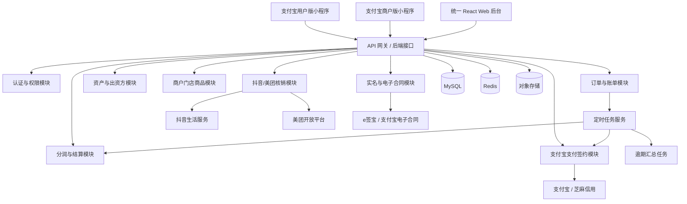
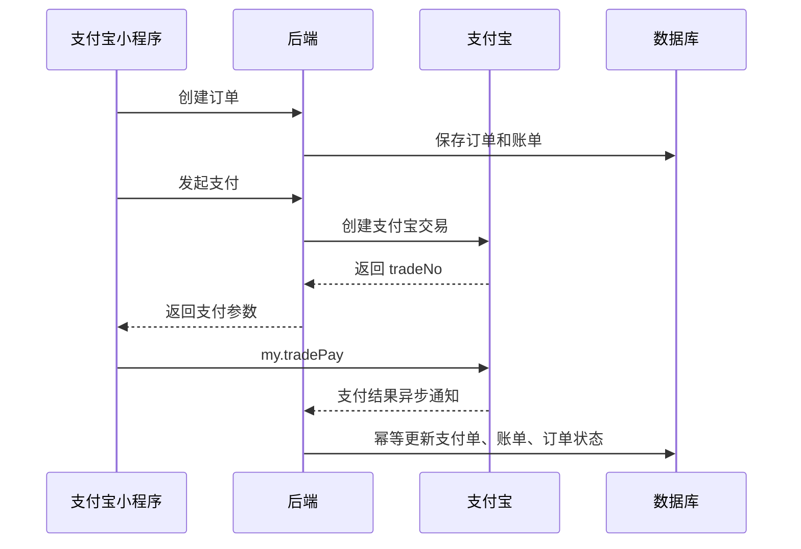
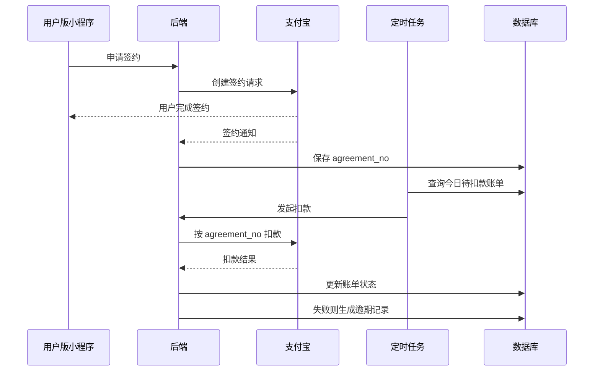

# 电车租赁平台技术选型架构

## 1. 架构目标

本项目第一版包含：

- 支付宝用户版小程序。
- 支付宝商户版小程序。
- 统一 Web 管理后台（总部模式 + 商户模式 + 出资方模式）。
- 后端业务服务。
- 定时任务与扣款任务。
- 支付宝、芝麻信用、电子签、抖音、美团等第三方能力对接。

技术架构目标：

- 第一版优先保证支付、签约、扣款、订单、资产、分润、逾期汇总的可靠性。
- 前端按两个小程序 + 一个后台拆分，避免用户端和商户端权限混杂。
- 后端第一版采用模块化单体，避免过早微服务化带来的研发和运维成本。
- 数据库以 MySQL 为主，关键业务保留规则快照，保证结算可追溯。
- 支付、扣款、核销、合同签署全部通过服务端完成，前端不直接调用第三方敏感接口。

## 2. 总体架构



## 3. 前端技术选型

### 3.1 支付宝用户版小程序

| 项目 | 选型 |
| --- | --- |
| 技术栈 | Vue 3 + TypeScript |
| 小程序框架 | uni-app |
| 状态管理 | Pinia |
| 请求库 | 封装 `uni.request` |
| UI 组件 | uni-ui + 自定义业务组件 |
| 构建目标 | 支付宝小程序 |

选择原因：

- 用户已明确小程序端使用 Vue。
- `uni-app` 基于 Vue 生态，后续如扩展微信小程序，可以保留一定复用空间。
- 两个小程序可以共用基础组件、请求封装、类型定义和业务 SDK。

用户版主要模块：

- 门店扫码进入。
- 商品列表。
- 商品详情和套餐选择。
- 抖音/美团券码输入或扫码。
- 支付宝支付。
- 支付宝签约扣款。
- 芝麻免押/资金授权。
- 身份证上传和实名。
- 合同签署跳转。
- 我的订单、账单、逾期补缴。

### 3.2 支付宝商户版小程序

| 项目 | 选型 |
| --- | --- |
| 技术栈 | Vue 3 + TypeScript |
| 小程序框架 | uni-app |
| 状态管理 | Pinia |
| 请求库 | 封装 `uni.request` |
| UI 组件 | uni-ui + 自定义业务组件 |
| 构建目标 | 支付宝小程序 |

商户版主要模块：

- 商户/员工登录。
- 门店工作台。
- 订单查询。
- 核销协助。
- 取车确认。
- 车架号/电池号绑定。
- 更换车辆/电池。
- 还车和结束订单。
- 门店资产库存。
- 分润收成查看。
- 逾期订单查看和催缴备注。

代码组织建议：

```text
user-mini/            # 支付宝用户版小程序，独立 package.json
merchant-mini/        # 支付宝商户版小程序，独立 package.json
```

两个小程序不建议做成一个小程序内多身份入口。原因：

- 用户端和商户端权限边界不同。
- 商户端会有资产、收益、订单操作等敏感功能。
- 两个小程序可以独立发布、独立审核、独立配置页面和权限。

### 3.3 统一 Web 管理后台

| 项目 | 选型 |
| --- | --- |
| 技术栈 | React + TypeScript |
| 构建工具 | Vite |
| UI 组件 | Ant Design |
| 路由 | React Router |
| 状态管理 | Zustand 或 Redux Toolkit |
| 表格/查询 | Ant Design Table + ProComponents |
| 图表 | AntV G2Plot / ECharts |

选择原因：

- 用户已明确后台使用 React。
- Ant Design 适合总部管理后台、表格、表单、筛选、权限菜单等场景。
- React + TypeScript 对大型后台的可维护性较好。
- 总部、商户、出资方本质上使用同一套业务底座，采用同一个 Web 工程拆成三个工作台模式，能最大化复用表格、详情页、权限模型和接口封装。

统一 Web 采用一个前端工程、三种工作台模式：

- 总部模式：平台管理员、财务。
- 商户模式：商户老板、店长、门店运营、维修、仓库人员。
- 出资方模式：出资方账号，仅查看自己名下资产与收益。

总部模式主要模块：

- 商户管理。
- 门店管理。
- 商品/SKU/套餐管理。
- 门店 SKU 批量上架。
- 分润规则管理。
- 资产管理。
- 出资方管理。
- 订单管理。
- 账单管理。
- 逾期订单汇总。
- 核销记录。
- 结算管理。
- 合同模板。
- 权限管理。
- 系统配置。

商户模式主要模块：

- 商户工作台。
- 我的门店。
- 门店订单与履约处理。
- 门店资产。
- 逾期订单跟进。
- 门店收益查看。

出资方模式主要模块：

- 出资方工作台。
- 我的资产。
- 收益分成。
- 资产详情下钻：租赁记录、账单记录、维修记录。
- 后续可扩展残值回收记录。

模式切换原则：

- 登录页提供 `总部登录`、`商户登录`、`出资方登录` 三个入口。
- 总部账号调用 `/api/auth/admin/login`。
- 商户账号调用 `/api/auth/merchant/login`。
- 出资方账号当前复用 `/api/auth/admin/login`，登录后按账号类型自动进入出资方工作台。
- 登录成功后根据账号类型自动进入对应工作台。
- 商户模式优先使用 `/api/merchant/*` 接口，避免误用总部全局接口导致数据越权。
- 出资方模式优先使用 `/api/investor/*` 接口，只返回当前出资方自己的资产与收益数据。

后台代码组织建议：

```text
admin-web/
  src/
    pages/
    components/
    services/
    stores/
    routes/
    permissions/
    workspace/          # 总部 / 商户 / 出资方模式菜单、路由、上下文
```

## 4. 后端技术选型

### 4.1 推荐选型

| 项目 | 选型 |
| --- | --- |
| 语言 | Java 21 |
| 框架 | Spring Boot 3.x |
| ORM | MyBatis-Plus |
| 数据库 | MySQL 8 |
| 缓存 | Redis |
| 任务调度 | XXL-JOB 或 Spring Scheduler + ShedLock |
| 消息队列 | RabbitMQ / RocketMQ，第一版可先预留 |
| 文件存储 | 阿里云 OSS / 腾讯云 COS |
| API 文档 | OpenAPI / Knife4j |
| 日志 | Logback + ELK/Loki |
| 监控 | Prometheus + Grafana，或云厂商 APM |

推荐第一版采用 **模块化单体**。

原因：

- 支付、账单、扣款、分润、结算存在强一致关系。
- 团队前期研发效率比服务拆分更重要。
- 模块化单体后续可以按支付、订单、资产、结算逐步拆服务。

### 4.2 后端模块划分

```text
server/
  module-auth             # 登录、员工、角色、权限
  module-user             # 用户体系
  module-merchant         # 商户、门店
  module-product          # 商品、SKU、套餐、门店 SKU
  module-order            # 订单、履约状态机
  module-bill             # 账单、扣款、补缴、逾期
  module-pay              # 支付宝支付、签约、回调、退款
  module-asset            # 车辆、电池、资产交接、变更、归还
  module-investor         # 出资方、资产归属、收益
  module-settlement       # 分润、结算、对账
  module-verify           # 抖音、美团核销
  module-contract         # OCR、实名、电子合同
  module-notify           # 短信、小程序通知、站内消息
  module-job              # 定时任务入口
  module-common           # 公共工具、异常、枚举、审计日志
```

### 4.3 核心状态机

订单状态建议单独做状态机，禁止各业务模块随意改状态。

主要状态：

- 待支付。
- 待实名。
- 待签约。
- 待免押。
- 待核销。
- 待取车。
- 租赁中。
- 待还车。
- 已逾期。
- 待补缴。
- 已完成。
- 已取消。
- 异常。

账单状态：

- 待支付。
- 待扣款。
- 扣款中。
- 已支付。
- 扣款失败。
- 待补缴。
- 已关闭。

资产状态：

- 空闲。
- 已绑定。
- 租赁中。
- 待检修。
- 维修中。
- 已报废。
- 已售出。
- 异常。

## 5. 数据库选型与设计原则

### 5.1 数据库

第一版使用 **MySQL 8**。

原因：

- 订单、账单、分润、结算强依赖事务。
- 财务数据需要稳定、可审计、可回溯。
- 团队招聘和维护成本低。

### 5.2 关键设计原则

- 所有金额使用 `BIGINT` 存分，避免浮点误差。
- 所有订单、账单、分润规则保存快照。
- 支付回调、扣款任务必须幂等。
- 所有第三方请求记录 request/response 摘要。
- 出资方收益、门店分润、平台留存分开明细表。
- 敏感字段脱敏存储，如身份证号、手机号。
- 财务相关数据禁止物理删除。

### 5.3 主要数据域

- 用户域：用户、支付宝 user_id、实名信息。
- 商户域：商户、门店、员工、权限。
- 商品域：SKU、套餐、门店 SKU、批量上架记录。
- 订单域：租赁订单、销售订单、核销订单。
- 账单域：首期账单、分期账单、逾期账单、补缴账单。
- 支付域：支付单、退款单、签约协议、扣款记录。
- 资产域：车辆、电池、资产交接单、变更单、归还单。
- 出资方域：出资方、资产归属、收益明细。
- 结算域：门店分润、出资方收益、平台留存、结算单、月结单主表、月结单明细表。

## 6. 支付宝支付与扣款架构

### 6.1 支付链路



### 6.2 签约扣款链路

核心原则：

- 支付宝不会自动帮商户跑账单。
- 用户签约后，后端需要保存 `agreement_no`。
- 每个账单日由后端定时任务主动发起扣款。
- 扣款失败进入失败重试和逾期汇总。



### 6.3 逾期扣费策略

所有租期逾期都要进入扣费流程，但扣费通道不同：

| 场景 | 扣费方式 |
| --- | --- |
| 7 天及以上账单周期 | 支付宝周期/商家扣款 |
| 小于 7 天逾期费用 | 芝麻免押/资金授权扣费 |
| 扣款失败 | 生成补缴账单 |
| 多次失败 | 逾期汇总 + 人工催缴 |

## 7. 三方平台对接

### 7.1 支付宝 / 芝麻信用

对接能力：

- 支付宝登录。
- 支付宝小程序支付。
- 支付宝退款。
- 支付宝签约扣款。
- 芝麻免押或资金授权。
- 支付宝账单下载和对账。

### 7.2 抖音 / 美团核销

所有核销必须由服务端调用，两个小程序不直接调用抖音/美团接口。

模块能力：

- 验券准备。
- 验券。
- 核销。
- 券状态查询。
- 核销记录查询。
- 异常重试。

### 7.3 OCR / 实名 / 电子合同

推荐组合：

- OCR：支付宝 OCR 或第三方 OCR。
- 实名：支付宝身份认证或第三方认证。
- 电子签：e 签宝 / 支付宝生态电子合同。
- 合同 PDF：电子签平台归档，不建议自研签章。

## 8. 部署架构

### 8.1 第一版部署

| 服务 | 部署方式 |
| --- | --- |
| 用户版小程序 | 支付宝小程序平台发布 |
| 商户版小程序 | 支付宝小程序平台发布 |
| 后台 Web | Nginx 静态资源 |
| 后端服务 | Docker + Spring Boot |
| MySQL | 云数据库 RDS |
| Redis | 云 Redis |
| OSS | 云对象存储 |
| 定时任务 | 独立 Job 进程或 XXL-JOB |

### 8.2 推荐环境

- dev：开发环境。
- test：测试环境。
- staging：预发环境。
- prod：生产环境。

生产环境建议：

- 后端至少 2 个实例。
- 定时任务单独部署，避免多实例重复扣款。
- 支付回调单独配置公网 HTTPS 域名。
- 数据库每日备份。
- 关键支付表开启操作审计。

## 9. 安全与风控

必须实现：

- 管理后台 RBAC 权限。
- 商户版小程序门店级数据隔离。
- 出资方只能看名下资产和收益。
- 支付回调验签。
- 抖音/美团回调或接口结果验签。
- 身份证号脱敏存储。
- 合同和身份证图片私有读写。
- 订单、账单、资产、分润操作审计日志。
- 扣款任务幂等锁。
- 资产换绑、结束订单二次确认。

## 10. 推荐仓库结构

```text
xni-rental-platform/
  user-mini/                # Vue/uni-app 支付宝用户版小程序，独立依赖
  merchant-mini/            # Vue/uni-app 支付宝商户版小程序，独立依赖
  admin-web/                # React 总部后台，独立依赖
  server/
    rental-api/             # Spring Boot 后端
    rental-job/             # 定时任务入口
  docs/
    api/
    database/
    deployment/
```

## 11. 第一版开发优先级

### P0

- 支付宝用户版小程序。
- 支付宝商户版小程序。
- 总部后台基础框架。
- 商户、门店、门店二维码。
- 商品、SKU、门店 SKU。
- 订单、账单。
- 支付宝支付。
- 支付宝签约扣款。
- 芝麻免押/资金授权。
- 资产绑定、交接、变更、归还。
- 逾期汇总。
- 分润规则和结算明细。

### P1

- 抖音/美团自动核销。
- OCR/实名。
- 电子合同。
- 出资方收益看板。
- 批量上架。
- 对账和导出。

### P2

- 微信小程序。
- 资产售卖。
- 分期买断。
- 更复杂风控策略。
- 多城市运营大屏。

## 12. 技术风险

| 风险 | 处理方式 |
| --- | --- |
| 支付宝扣款不是自动触发 | 自研账单定时任务和扣款任务 |
| 小于 7 天账单不能用周期扣款 | 用芝麻免押/资金授权/主动补缴兜底 |
| 美团/抖音权限未开通 | 先做人工核销登记，自动核销作为开通后能力 |
| 分润规则频繁变化 | 订单保存规则快照 |
| 多门店资产变更复杂 | 所有资产操作生成凭证 |
| 财务对账复杂 | 支付单、账单、分润、结算分表保存 |

## 13. 参考依据

- uni-app 可使用 Vue 开发并发布到多端小程序：https://github.com/dcloudio/uni-app
- 支付宝 IDE 支持 uni-app 扩展：https://opendocs.alipay.com/mini/ide/uni-app
- React 官方文档：https://zh-hans.react.dev/
- React TypeScript 文档：https://zh-hans.react.dev/learn/typescript
- Ant Design React 组件库：https://ant.design/docs/react/introduce/
- Spring Boot 官方文档：https://docs.spring.io/spring-boot/index.html
